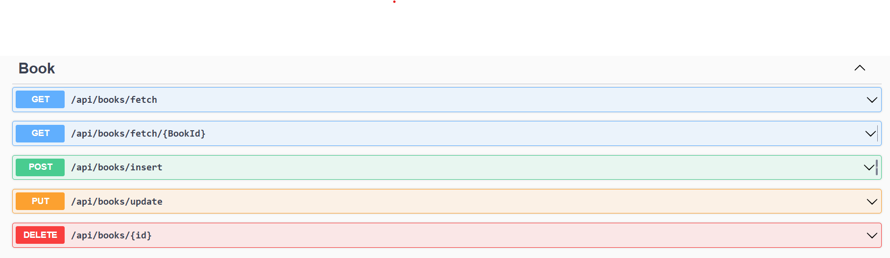
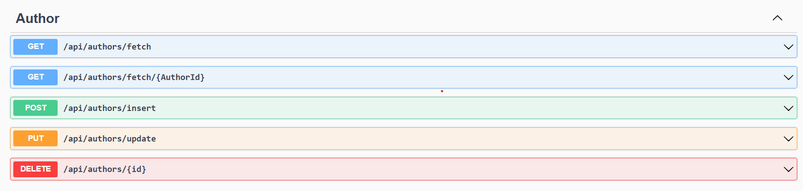
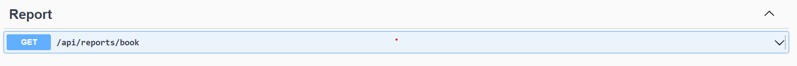
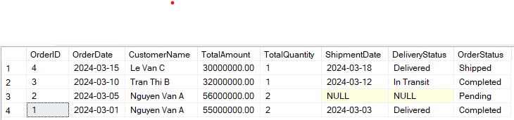
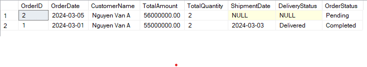
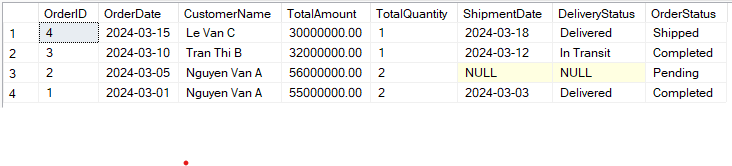
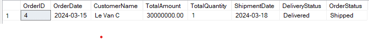
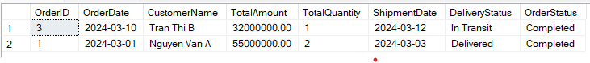
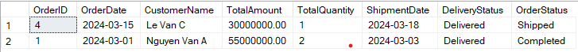
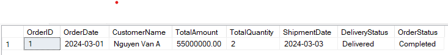

# Exercises

## Ex1
## Mã nguồn
- Thư mục project ASP.NET Core Web API: `Ex1`
- 
## Công nghệ sử dụng

- **.NET Core 6** - Framework chính, cung cấp hiệu suất cao và khả năng mở rộng tốt.
- **SQL Server** - Hệ quản trị cơ sở dữ liệu được sử dụng.
- **Entity Framework (EF Core)** - Tương tác dễ dàng hơn với cơ sở dữ liệu.

## Kiểm thử

- Sử dụng Swagger để kiểm thử API

### Books


### Authors



### Report



## Kết quả

### Books

- `GET /api/books/fetch` - Lấy danh sách tất cả sách.

```json
{
  "data": [
    {
      "bookId": 1,
      "title": "Đời ngắn đừng ngủ dài",
      "price": 200000,
      "authorId": 1,
      "publishedDate": "2025-03-27T00:00:00",
      "author": {
        "authorId": 1,
        "name": "Đại Cương",
        "bio": "Bala bala"
      }
    },
    ...,
    {
      "bookId": 6,
      "title": "Thao túng tâm lý",
      "price": 100000,
      "authorId": 6,
      "publishedDate": "2025-03-27T00:00:00",
      "author": {
        "authorId": 6,
        "name": "Nguyễn Văn D",
        "bio": "Nhà khoa học"
      }
    }
  ],
  "isSuccess": true,
  "message": "All books",
  "statusCode": 200
}
```

- `GET /api/books/fetch/{BookId}` - Lấy thông tin sách theo BookId = 1.

```json
{
  "data": {
    "bookId": 1,
    "title": "Đời ngắn đừng ngủ dài",
    "price": 200000,
    "authorId": 1,
    "publishedDate": "2025-03-27T00:00:00",
    "author": {
      "authorId": 1,
      "name": "Đại Cương",
      "bio": "Bala bala"
    }
  },
  "isSuccess": true,
  "message": "Book with ID 1",
  "statusCode": 200
}
```

- `POST /api/books/insert` - Tạo mới một sách.

```json
{
  "isSuccess": true,
  "message": "Book created successfully",
  "statusCode": 201
}
```

- `POST /api/books/insert` - Tạo mới một sách với tiêu đề rỗng.

```json
{
  "isSuccess": false,
  "message": "Tiêu đề sách không được để trống.",
  "statusCode": 422
}
```

- `PUT /api/books/update` - Cập nhật thông tin sách.

```json
{
  "isSuccess": true,
  "message": "Book updated successfully",
  "statusCode": 200
}
```

- `DELETE /api/books/{id}` - Xóa sách theo ID.

```json
{
  "isSuccess": true,
  "message": "Book deleted successfully",
  "statusCode": 200
}
```

---

### Authors

- `GET /api/authors/fetch` - Lấy danh sách tất cả tác giả.

```json
{
  "data": [
    {
      "authorId": 1,
      "name": "Đại Cương",
      "bio": "Bala bala"
    },
    {
      "authorId": 2,
      "name": "Nguyễn Văn A",
      "bio": "Alibaba"
    },
    {
      "authorId": 4,
      "name": "Nguyễn Văn B",
      "bio": "Nhà sử học"
    },
    {
      "authorId": 5,
      "name": "Nguyễn Văn C",
      "bio": "Nhà văn học"
    },
    {
      "authorId": 6,
      "name": "Nguyễn Văn D",
      "bio": "Nhà khoa học"
    },
    {
      "authorId": 7,
      "name": "Nguyễn Văn D",
      "bio": "Nhà khoa học"
    }
  ],
  "isSuccess": true,
  "message": "All authors",
  "statusCode": 200
}
```

- `GET /api/authors/fetch/1` - Lấy thông tin tác giả theo ID = 1.

```json
{
  "data": {
    "authorId": 1,
    "name": "Đại Cương",
    "bio": "Bala bala"
  },
  "isSuccess": true,
  "message": "Author by id 1",
  "statusCode": 200
}
```

- `POST /api/authors/insert` - Tạo mới một tác giả.

```json
{
  "isSuccess": true,
  "message": "Author created successfully",
  "statusCode": 201
}
```

- `POST /api/authors/insert` - Tạo mới một tác giả với tên rỗng(Những trường khác bắt buộc nhập nếu rỗng thì cũng nhận response tương tự).

```json
{
  "isSuccess": false,
  "message": "Tên tác giả không được để trống.",
  "statusCode": 422
}
```

- `PUT /api/authors/update` - Cập nhật thông tin tác giả.

```json
{
  "isSuccess": true,
  "message": "Author updated successfully",
  "statusCode": 200
}
```

- `DELETE /api/authors/{id}` - Xóa tác giả theo ID.

```json
{
  "isSuccess": true,
  "message": "Author deleted successfully",
  "statusCode": 200
}
```

---

### Report

- `GET /api/reports/book?searchKey=&authordd=&fromPublishedDate=&toPublishedDate=?pageSize=?pageIndex=`

  - Lọc sách theo từ khóa, tác giả, ngày xuất bản.
  - Hỗ trợ phân trang với `pageSize` và `pageIndex`.

- Thử không lọc với bất kì query string nào:

```json
{
  "pagination": {
    "page": 1,
    "pageSize": 10,
    "totalPages": 1,
    "totalCount": 4
  },
  "data": [
    {
      "bookId": 1,
      "title": "Đời ngắn đừng ngủ dài aaaa",
      "price": 120000,
      "authorId": 1,
      "publishedDate": "2025-03-27T00:00:00",
      "author": {
        "authorId": 1,
        "name": "Đại Cương",
        "bio": "Bala bala"
      }
    },
    {
      "bookId": 5,
      "title": "Book D",
      "price": 100000,
      "authorId": 5,
      "publishedDate": "2025-03-27T00:00:00",
      "author": {
        "authorId": 5,
        "name": "Nguyễn Văn C",
        "bio": "Nhà văn học"
      }
    },
    {
      "bookId": 7,
      "title": "Sách mới 1",
      "price": 100000,
      "authorId": 1,
      "publishedDate": "2025-03-27T00:00:00",
      "author": {
        "authorId": 1,
        "name": "Đại Cương",
        "bio": "Bala bala"
      }
    }
  ],
  "isSuccess": true,
  "message": "All books with filters",
  "statusCode": 200
}
```

- Thử lọc theo từ khóa `đ`, ngày xuất bản `2025-03-27T00:00:00`, authorID = `1`, page = `1` và pageSize = `10`.

```json
{
  "pagination": {
    "page": 1,
    "pageSize": 10,
    "totalPages": 1,
    "totalCount": 1
  },
  "data": [
    {
      "bookId": 1,
      "title": "Đời ngắn đừng ngủ dài aaaa",
      "price": 120000,
      "authorId": 1,
      "publishedDate": "2025-03-27T00:00:00",
      "author": {
        "authorId": 1,
        "name": "Đại Cương",
        "bio": "Bala bala"
      }
    }
  ],
  "isSuccess": true,
  "message": "All books with filters",
  "statusCode": 200
}
```

---

## Ex2

Bài tập này yêu cầu xây dựng một Stored Procedure trong SQL Server để tạo báo cáo chi tiết về đơn hàng trong hệ thống thương mại điện tử. Báo cáo cần hiển thị danh sách các đơn hàng trong một khoảng thời gian nhất định, kèm theo thông tin khách hàng, chi tiết đơn hàng và trạng thái giao hàng.

### Mã nguồn

- Đường dẫn file mã sql nằm trong thư mục `sql` tên file: `Ex2.sql`

### Stored Procedure

```sql
CREATE PROCEDURE GetComplexOrderReport
    @StartDate DATE,
    @EndDate DATE,
    @CustomerID INT = NULL,
    @MinAmount DECIMAL(10,2) = NULL,
    @MaxAmount DECIMAL(10,2) = NULL,
    @OrderStatus NVARCHAR(50) = NULL,
    @ShipmentStatus NVARCHAR(50) = NULL
AS
BEGIN
    SET NOCOUNT ON

    SELECT
        o.OrderID,
        o.OrderDate,
        c.Name AS CustomerName,
        SUM(oi.Quantity * oi.Price) AS TotalAmount,
        SUM(oi.Quantity) AS TotalQuantity,
        s.ShipmentDate,
        s.DeliveryStatus,
        o.Status AS OrderStatus
    FROM Orders o
    INNER JOIN Customers c ON o.CustomerID = c.CustomerID
    INNER JOIN OrderItems oi ON o.OrderID = oi.OrderID
    LEFT JOIN Shipments s ON o.OrderID = s.OrderID
    WHERE
        o.OrderDate BETWEEN @StartDate AND @EndDate
        AND (@CustomerID IS NULL OR o.CustomerID = @CustomerID)
        AND (@OrderStatus IS NULL OR o.Status = @OrderStatus)
        AND (@ShipmentStatus IS NULL OR s.DeliveryStatus = @ShipmentStatus)
    GROUP BY
        o.OrderID, o.OrderDate, c.Name, s.ShipmentDate, s.DeliveryStatus, o.Status
    HAVING
        (@MinAmount IS NULL OR SUM(oi.Quantity * oi.Price) >= @MinAmount)
        AND (@MaxAmount IS NULL OR SUM(oi.Quantity * oi.Price) <= @MaxAmount)
    ORDER BY o.OrderDate DESC
END
GO
```

### Kiểm thử

- Mong đợi: Hiển thị tất cả đơn hàng từ ngày 01/03 đến 31/03.

  - Query

  ```sql
  EXEC GetComplexOrderReport
    @StartDate = '2024-03-01',
    @EndDate = '2024-03-31',
    @CustomerID = NULL,
    @MinAmount = NULL,
    @MaxAmount = NULL,
    @OrderStatus = NULL,
    @ShipmentStatus = NULL
  ```

  - Kết quả
    
  

  ***

- Mong đợi: Chỉ hiển thị đơn hàng của khách hàng `CustomerID = 1`.

  - Query

  ```sql
  EXEC GetComplexOrderReport
    @StartDate = '2024-03-01',
    @EndDate = '2024-03-31',
    @CustomerID = 1,
    @MinAmount = NULL,
    @MaxAmount = NULL,
    @OrderStatus = NULL,
    @ShipmentStatus = NULL
  ```

  - Kết quả
    
  

  ***

- Mong đợi: Chỉ hiển thị đơn hàng có tổng giá trị từ 28 triệu trở lên.

  - Query

  ```sql
  EXEC GetComplexOrderReport
    @StartDate = '2024-03-01',
    @EndDate = '2024-03-31',
    @CustomerID = NULL,
    @MinAmount = 28000000,
    @MaxAmount = NULL,
    @OrderStatus = NULL,
    @ShipmentStatus = NULL
  ```

  - Kết quả
    
  

  ***

- Mong đợi: Chỉ hiển thị đơn hàng có tổng giá trị dưới hoặc bằng 30 triệu.

  - Query

  ```sql
  EXEC GetComplexOrderReport
    @StartDate = '2024-03-01',
    @EndDate = '2024-03-31',
    @CustomerID = NULL,
    @MinAmount = NULL,
    @MaxAmount = 30000000,
    @OrderStatus = NULL,
    @ShipmentStatus = NULL
  ```

  - Kết quả
    
  

  ***

- Mong đợi: Chỉ hiển thị các đơn hàng có trạng thái 'Completed'.

  - Query

  ```sql
  EXEC GetComplexOrderReport
    @StartDate = '2024-03-01',
    @EndDate = '2024-03-31',
    @CustomerID = NULL,
    @MinAmount = NULL,
    @MaxAmount = NULL,
    @OrderStatus = 'Completed',
    @ShipmentStatus = NULL
  ```

  - Kết quả
    
  

  ***

- Mong đợi: Chỉ hiển thị các đơn hàng có tình trạng giao hàng là `Delivered`.

  - Query

  ```sql
  EXEC GetComplexOrderReport
    @StartDate = '2024-03-01',
    @EndDate = '2024-03-31',
    @CustomerID = NULL,
    @MinAmount = NULL,
    @MaxAmount = NULL,
    @OrderStatus = NULL,
    @ShipmentStatus = 'Delivered'
  ```

  - Kết quả
  
  

  ***

- Chỉ hiển thị đơn hàng của `CustomerID = 1`, có tổng tiền từ 25 triệu đến 60 triệu, có trạng thái `Completed` và đã được giao hàng `Delivered`.
  - Query
  ```sql
  EXEC GetComplexOrderReport
    @StartDate = '2024-03-01',
    @EndDate = '2024-03-31',
    @CustomerID = 1,
    @MinAmount = 25000000,
    @MaxAmount = 60000000,
    @OrderStatus = 'Completed',
    @ShipmentStatus = 'Delivered'
  ```
  - Kết quả
    
  

---

> Cảm ơn chị đã dành thời gian đọc và xem xét bài tập này. Em rất trân trọng cơ hội được thể hiện kỹ năng của mình và mong muốn có cơ hội trao đổi thêm về công việc. Hy vọng chị có một ngày làm việc vui vẻ và hiệu quả! 😊
